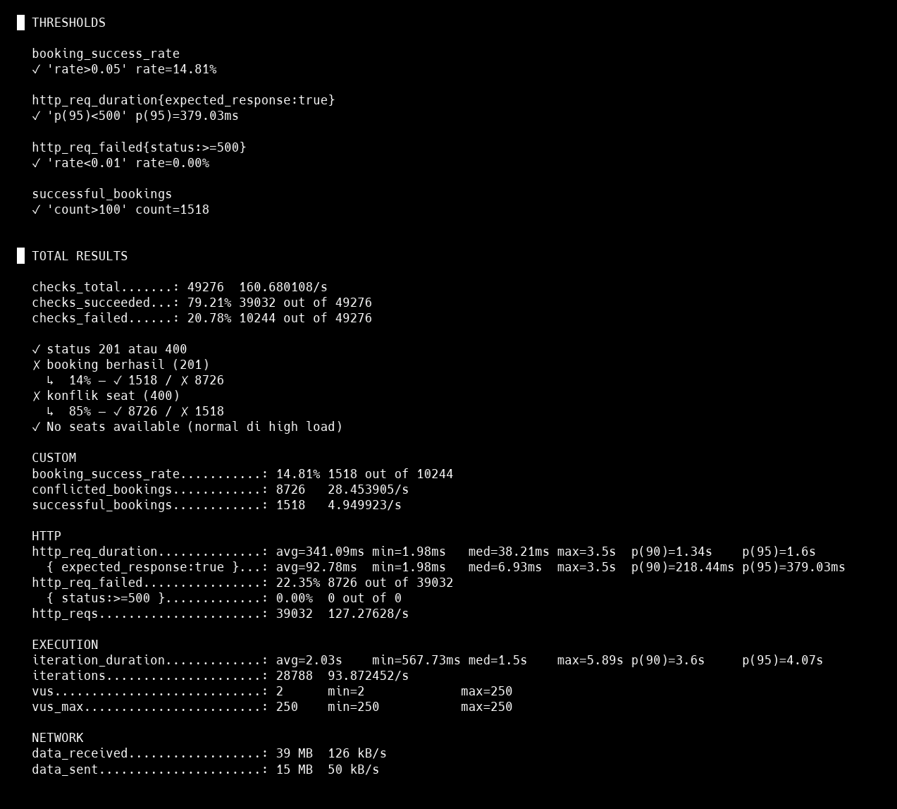

# 📊 Performance Test Results

Dokumentasi hasil load testing untuk membuktikan kemampuan sistem dalam menangani high-volume concurrent requests.

---

## 📋 Table of Contents

- [Test Overview](#test-overview)
- [Test Configuration](#test-configuration)
- [Results Summary](#results-summary)
- [Key Metrics](#key-metrics)
- [Analysis](#analysis)
- [How to Reproduce](#how-to-reproduce)

---

## Test Overview

Load test dilakukan menggunakan **k6** untuk mensimulasikan skenario "Ticket War" — kondisi di mana ribuan user mencoba membooking tiket secara bersamaan saat penjualan dibuka.

### Test Scenario

Simulasi realistic ticket sale dengan pola traffic:

1. **Warm-up** (30s): Gradual ramp-up ke 50 VUs
2. **Burst** (1m): Spike ke 250 VUs (simulasi open sale)
3. **Sustained Load** (3m): Maintain 250 concurrent users
4. **Cool-down** (30s): Gradual ramp-down

### Infrastructure

Semua services berjalan via Docker Compose pada single machine:

- **App**: NestJS application (1 instance)
- **Database**: PostgreSQL 15
- **Cache/Queue**: Redis 7
- **Load Generator**: k6 (Docker container)

---

## Test Configuration

### k6 Test Stages

```javascript
stages: [
  { duration: '30s', target: 50 },   // Warm-up
  { duration: '1m', target: 250 },   // Burst to peak
  { duration: '3m', target: 250 },   // Sustained load
  { duration: '30s', target: 0 },    // Cool-down
]
```

### Thresholds

```javascript
thresholds: {
  'http_req_failed{status:>=500}': ['rate<0.01'],      // <1% server errors
  'http_req_duration{expected_response:true}': ['p(95)<500'],  // p95 < 500ms
  'successful_bookings': ['count>100'],
  'booking_success_rate': ['rate>0.05'],               // >5% success rate
}
```

### Test Flow (per iteration)

1. `GET /api/v1/booking` — Fetch available seats
2. `POST /api/v1/booking` — Attempt to book a random available seat
3. Random sleep (0.5–3s) between iterations

---

## Results Summary

### ✅ All Thresholds Passed

| Threshold | Target | Actual | Status |
|-----------|--------|--------|--------|
| Server Error Rate (5xx) | < 1% | **0.00%** | ✅ PASS |
| Response Time p95 | < 500ms | **379ms** | ✅ PASS |
| Successful Bookings | > 100 | **1,518** | ✅ PASS |
| Booking Success Rate | > 5% | **14.81%** | ✅ PASS |

### 📈 Throughput

| Metric | Value |
|--------|-------|
| **Total HTTP Requests** | 39,032 |
| **Requests per Second** | ~127 RPS |
| **Total Iterations** | 28,788 |
| **Iterations per Second** | ~94/s |
| **Test Duration** | 5 minutes 6 seconds |

### 🎯 Booking Outcomes

| Outcome | Count | Percentage |
|---------|-------|------------|
| Successful Bookings (201) | 1,518 | 14.81% |
| Conflict/Already Booked (400) | 8,726 | 85.19% |
| Server Errors (5xx) | 0 | 0.00% |

> **Note**: High conflict rate (85%) adalah **expected behavior** dalam skenario ticket war. Ini membuktikan distributed locking bekerja dengan benar — hanya satu request yang berhasil untuk setiap seat.

---

## Key Metrics

### Response Time Distribution

| Percentile | All Requests | Successful Requests |
|------------|--------------|---------------------|
| Minimum | 1.98ms | 1.98ms |
| Median (p50) | 38.21ms | 6.93ms |
| p90 | 1.34s | 218.44ms |
| p95 | 1.60s | 379.03ms |
| Maximum | 3.5s | 3.5s |
| Average | 341.09ms | 92.78ms |

### Infrastructure Health

| Metric | Value |
|--------|-------|
| **Server Error Rate** | 0.00% |
| **Infrastructure Failures** | 0 |
| **Dropped Connections** | 0 |

---

## Analysis

### 1. Zero Server Errors ✅

Sistem berhasil menangani **39,032 requests** tanpa satupun server error (5xx). Ini membuktikan:

- Database connection pooling bekerja dengan baik
- Redis tidak mengalami bottleneck
- Error handling properly catches business logic errors

### 2. Distributed Locking Works ✅

Dari 10,244 booking attempts:

- **1,518 succeeded** (14.81%)
- **8,726 rejected** karena seat sudah di-lock atau di-book (85.19%)

Ini adalah **expected behavior** — distributed locking mencegah race condition dan double-booking.

### 3. Fast Response for Successful Requests

Untuk successful requests:

- **Median: 6.93ms** — Sangat cepat berkat Redis caching
- **p95: 379ms** — Di bawah threshold 500ms

### 4. High Conflict Rate = System Working Correctly

Conflict rate 85% menunjukkan:

- Redis locks aktif mencegah concurrent access ke seat yang sama
- Database transaction dengan optimistic locking berfungsi
- Tidak ada double-booking

---

## Evidence

### k6 Test Output Screenshot



### Grafana Dashboards During Load Test

Selama load test, beberapa panel utama di Grafana digunakan sebagai bukti visual:

- **HTTP RPS by Route** – `docs/images/grafana-http-rps.png`
- **HTTP p95 Latency** – `docs/images/grafana-latency.png`
- **Bookings Pending / Booking Activity** – `docs/images/grafana-bookings-pending.png`

Panel-panel ini menunjukkan hubungan antara traffic (RPS), latency, dan jumlah booking pending saat beban tinggi.

---

## How to Reproduce

### Prerequisites

- Docker and Docker Compose installed
- All services running (`docker-compose up -d`)
- Sufficient test data (seats) in database

### Run Load Test

```powershell
# Using Docker (recommended)
Get-Content .\load.test.js | docker run --rm -i -v ${PWD}:/src -w /src grafana/k6 run - --summary-export=/src/k6-summary.json
```

```bash
# Linux/Mac alternative
cat load.test.js | docker run --rm -i -v $(pwd):/src -w /src grafana/k6 run -

# Using local k6 installation
k6 run load.test.js
```

### Reset Test Data

Sebelum menjalankan load test, pastikan ada cukup seats yang available:

```bash
# Reset via Prisma seed
npx prisma db seed

# Or manually via SQL
UPDATE "Seat" SET status = 'AVAILABLE';
DELETE FROM "Booking";
```

### View Results

- **k6 Summary**: Check terminal output atau `k6-summary.json`
- **Prometheus**: http://localhost:9090 — Query `http_requests_total`
- **Grafana**: http://localhost:3001 — View dashboards

---

## Conclusions

Load test membuktikan sistem dapat:

1. **Handle high concurrency** — 250 concurrent users, ~127 RPS
2. **Maintain zero infrastructure failures** — 0% server error rate
3. **Prevent race conditions** — Distributed locking bekerja dengan benar
4. **Respond quickly** — p95 response time 379ms untuk successful requests

Sistem siap untuk production deployment dengan horizontal scaling untuk mencapai throughput lebih tinggi.

---

## Related Documentation

- [Architecture Documentation](./architecture.md) — Detail tentang distributed locking dan caching
- [API Documentation](./api.md) — API endpoints dan best practices